# How to build Service Request using Record Producers

When using a record producers to create a catalogue item, a common problems developers come across is how to get the requests to show in the standard requests widget in the Employee Service Center or one of the standard portals. By default your record producer will not show in the standard request widget. It will show when the user creates the request, but once they navigate away and come back to look for the request, it will now show.

In this example we going to create a fictional request that is going to populate a table that will then ultimately drive other workflows. We won't go into those examples here.

## Example Service Request App
Our example application is for a Service Request for vetting new employees at "Big Airport". In this example we will produce a small application that is designed to receive new employee vetting requests from a catalogue record producer. The vetting requests will go on to trigger other tasks that need to be accomplished, but for the purposes of this example, we will be looking at how to get the request to show in the requests widget in the Employee Service Center.

### Create a new App using App Engine Studio
Log into your dev environment and create a new application, in this example we will be calling it out Employee Vetting application

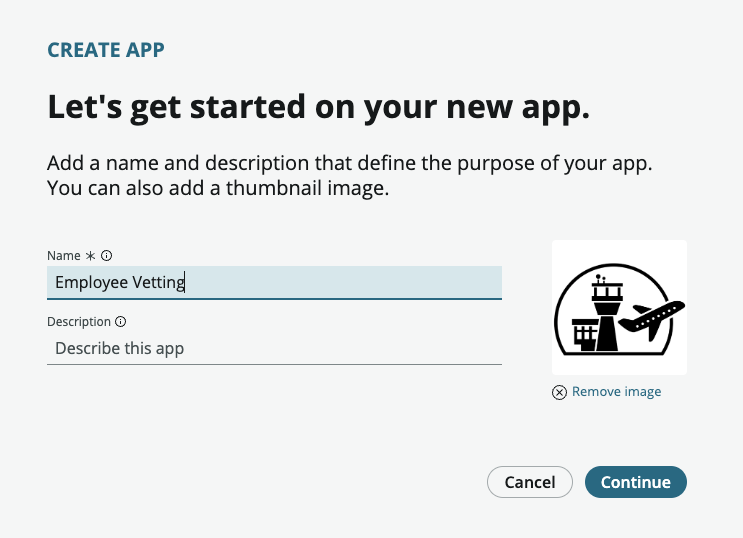

Run through the setup process to create the basic application.

### Create the base table to handle our request.

We are going to base our request table of the base **task** table. The main reason for this is that it contains alot of the standard fields we need such as the work notes etc that will make it easier for us to pass back notes to the person who has made the request.

These are the properties of the table that was created

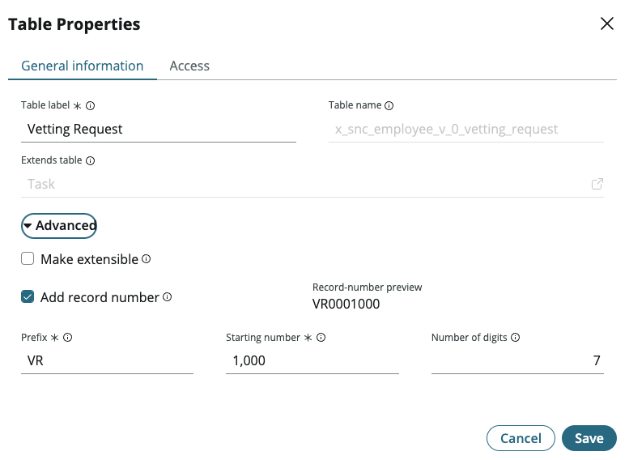

Hiding the extended fields in the table view, add three new fields which we will add to our record producer.

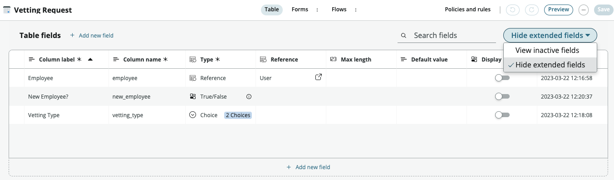

Below is a table of the fields added to the new table.

| Field Label | Field Name | Type | Reference / Choice Information |
|-------------|------------|------|-------|
| Employee | employee | Reference | sys_user table |
| New Employee ? | new_employee | True / False |
| Vetting Type | vetting_type | Choice | 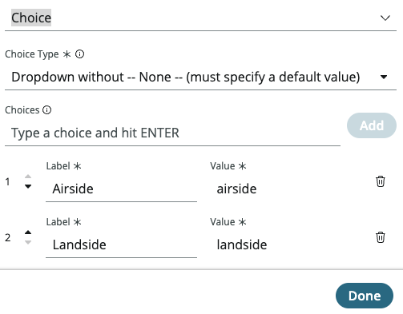 |

### Update the form for the new table.
Once you have created the fields, now you need to update the form to make sure your new fields are showing. At the top of the table view, click **Forms** to show the form designer. From here change the layout as you want to incorporate the new fields.

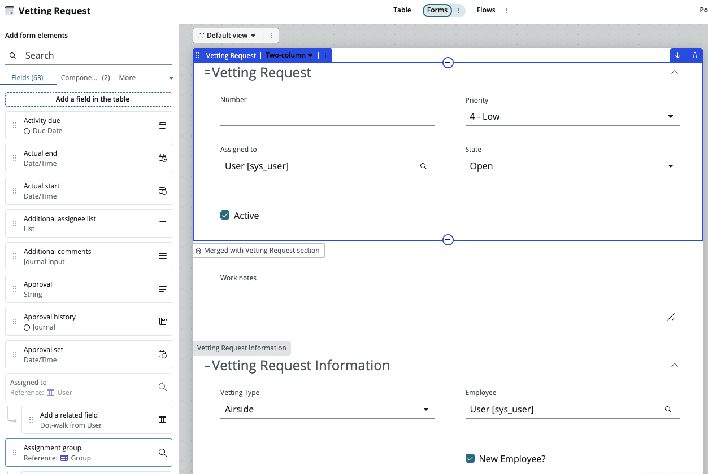

### Creating the record producer.

Now we have a table to be the destination of the record producer, we now need to create catalogue item. 

In your application, go to the experiences section and create a new experience. When propmpted select **Record Producer** as shown here

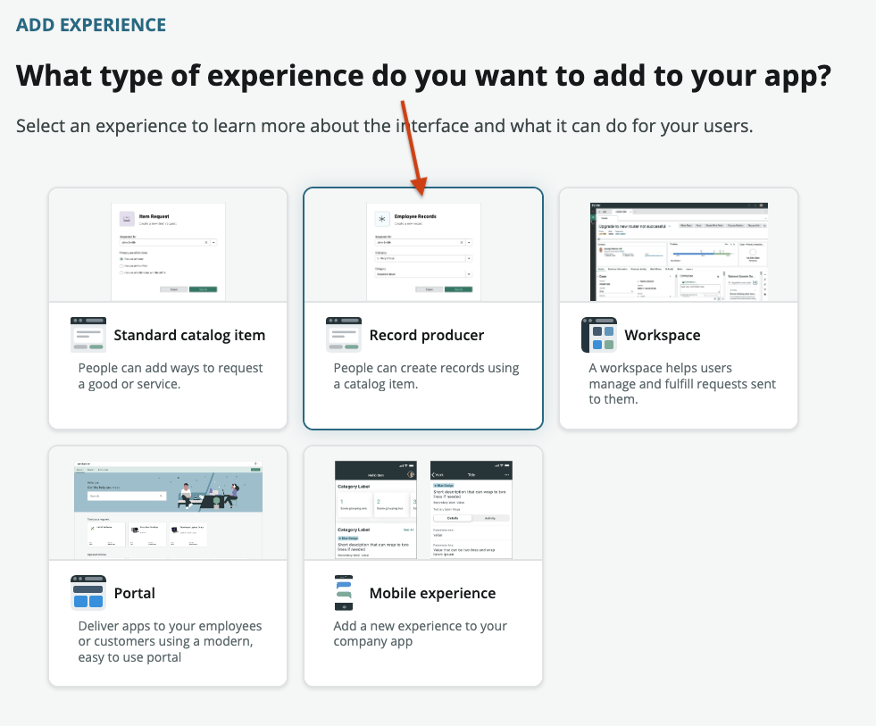

Give the record producer a name such as "New Employee Vetting", add am image to help people understand what it is and give a description of the request.

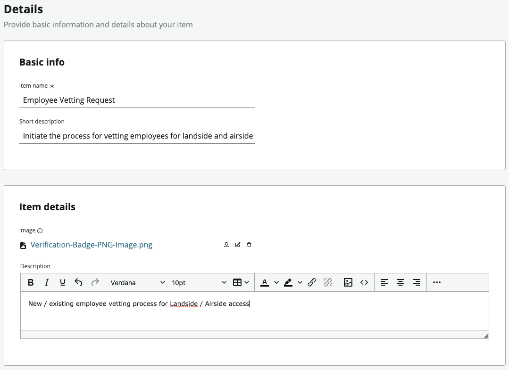

Set the destination to be the new table that you have just created

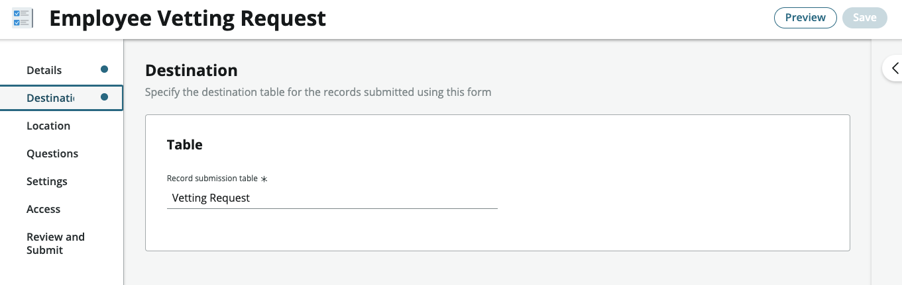

You now need to add the questions that you need to ask. In this case it's the three new fields that we created.

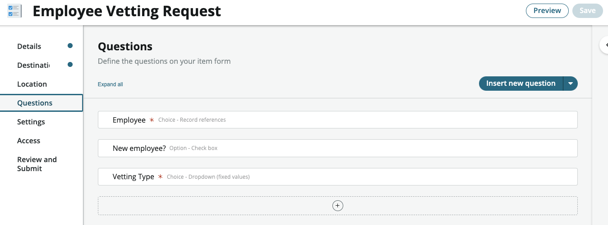

These questions are associated with the new fields that you created, so for example the Employee question will look like this

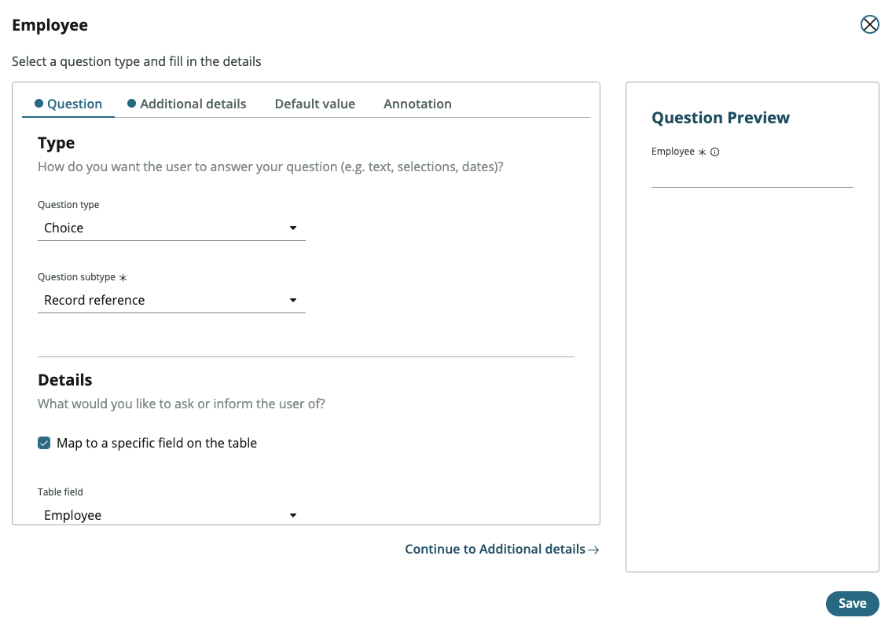

The additional information will attach the choice to the standard **sys_user** table. Add any additional filters you need here as well to make the user list more relevant.

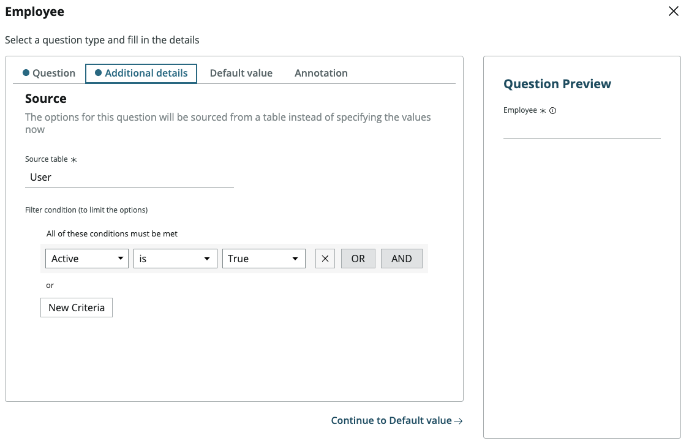

Add the relevant roles for people who can access this catalogue item. In this case I just wanted anyone for be able to make the request.

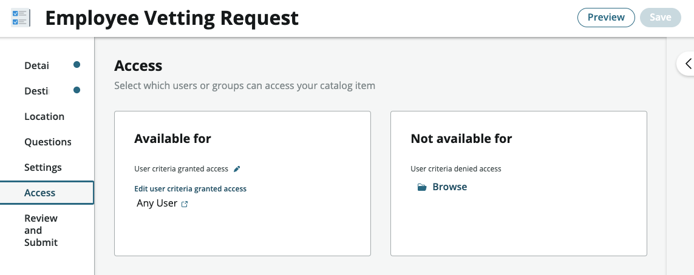

You have now created a simple request application that will capture the catalogue item request data directly into a table. Now lets test it out.

## Employee Service Center (ESC)

Navigate to Employee Service Center on your system. If you don't have it installed, you can just use a standard Service Portal as well. You just need to make sure the Catalogue that you attached your item to is active in that portal.

Do a search for "Vetting" in the search bar. Your catalogue item should be returned

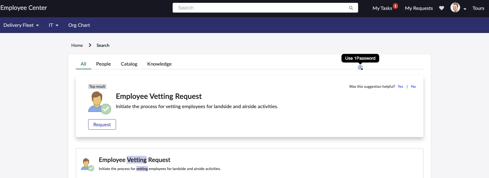

Open the request and fill in the questions.

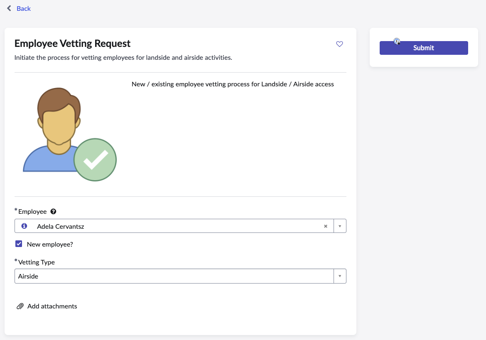

Click the submit button and you will see the standard request confirmation screen.

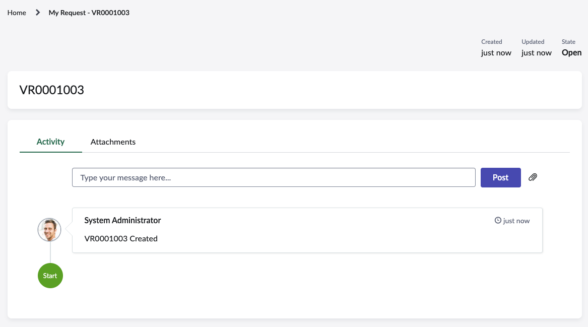

All good. If we now navigate away from this and view our other requests, we will see that our new request is not shown.

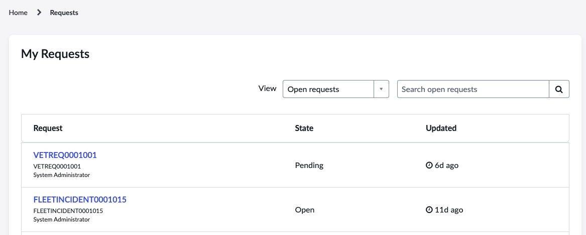

## Adding the new request into the standard My Requests widget.

To add the new request into the My Requests widget, we need to update the configuration of this widget. Thankfully this is simple enough to do.

In your ServiceNow system, go back to the main navigation page. In the All Menu, type the following

> request_filter.list

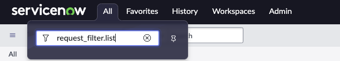

Now you will see a list of the request types that will be shown in the My Requests.

Click New and fill in the information about the table.
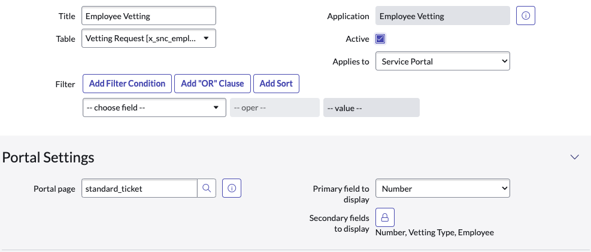

Key information is

| Form field | Value | Notes |
|---|---|---|
| **Table** | x_snc_employee_v_0_vetting_request | The table in your app |
| **Applies to** | Service Portal ||
| **Active** | Checked ||
| **Portal page** | standard_ticket ||
| **Primary field** | Number | This is the main highlighted field, Short description is often used, but we haven't populated this in our example |
| **Secondary fields to display** | Pick a selection of the fields you want to show ||

Click Save or Update to save this to the

### Back to the Employee Portal

Now if we navigate back to the employee portals "My Requests" widget, we will now see that the new request that we put in is showing. You will need to refresh the page if you haven't already.

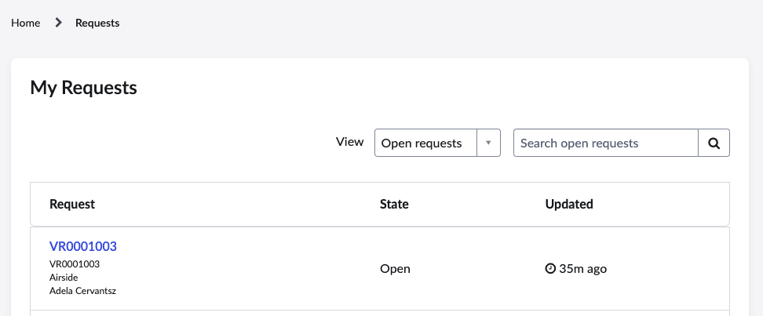

Clicking on the link will now show the request screen we had original seen when creating the request.

 
